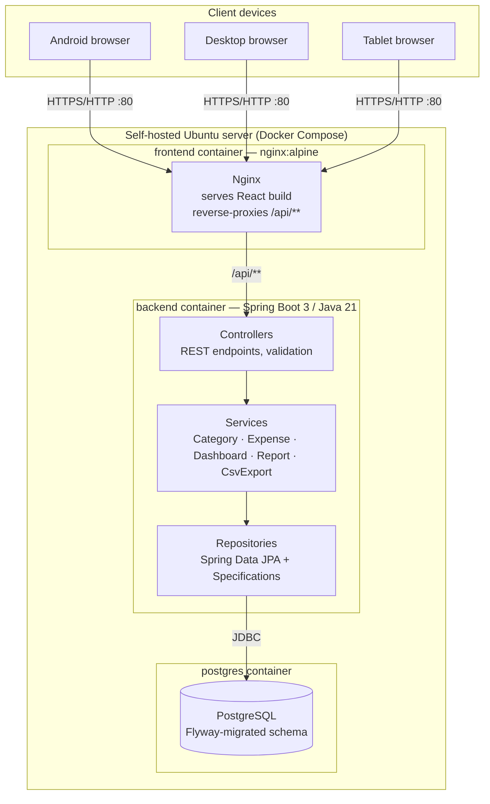

# Expense Tracker

A self-hosted personal expense tracking web application. Track daily
expenses, organize them into your own categories, browse a dashboard,
generate reports, and export everything to CSV — all running on your own
hardware, with no cloud dependency.

Built to the project's SRS: Spring Boot 3 / Java 21 backend, React + MUI
frontend, PostgreSQL, Docker Compose, and a full test suite.

---

## Architecture



**Request flow:** browser → Nginx (serves the static React bundle, reverse
proxies `/api/**`) → Spring Boot controller → service layer (business rules,
DTO mapping via MapStruct) → repository layer (Spring Data JPA +
`Specification`-based dynamic queries) → PostgreSQL, with schema managed
entirely by Flyway migrations.

---

## Tech stack

| Layer | Technology |
|---|---|
| Backend | Java 21, Spring Boot 3.3.4, Spring Data JPA, Spring Validation, Spring Security (structured, disabled by default), MapStruct, Lombok, Flyway, springdoc-openapi |
| Database | PostgreSQL 16 |
| Frontend | React 18, Vite, Material UI, Axios, React Router, Recharts |
| Infra | Docker, Docker Compose, Nginx |
| Testing | JUnit 5, Mockito, AssertJ, Spring Test (`@DataJpaTest`, `@WebMvcTest`, `@SpringBootTest`), H2 |

---

## Project structure

```
expense-tracker/
├── backend/                 Spring Boot API
│   ├── src/main/java/com/expensetracker/
│   │   ├── entity/          JPA entities (Category, Expense, enums)
│   │   ├── repository/      Spring Data repositories + Specifications
│   │   ├── dto/              Request/response DTOs
│   │   ├── mapper/           MapStruct entity <-> DTO mappers
│   │   ├── service/           Business logic (Category, Expense, Dashboard, Report, CsvExport)
│   │   ├── controller/        REST controllers
│   │   ├── config/            Security, OpenAPI configuration
│   │   └── exception/         Custom exceptions + global handler
│   ├── src/main/resources/
│   │   ├── db/migration/      Flyway migrations (V1-V4)
│   │   └── application*.yml   Config (default, dev, prod)
│   ├── src/test/java/...      Repository / service / controller / integration tests
│   └── Dockerfile
├── frontend/                 React + MUI SPA
│   └── src/
│       ├── api/, services/    Axios client + per-domain API services
│       ├── components/        Layout (sidebar/bottom-nav), category & expense widgets, common UI
│       ├── pages/              Dashboard, Expenses, Categories, Reports, Settings
│       ├── hooks/, context/    useDebounce, useCategories, NotificationContext
│       └── theme/              Ledger-aesthetic MUI theme
│   └── Dockerfile
├── docker/nginx/              Reverse proxy + TLS + rate limiting config
├── docker-compose.yml         postgres + backend + frontend
├── .env.example
└── BUILD_PROGRESS.md          Module-by-module build log
```

---

## Getting started

### Option A — Docker Compose (recommended for the self-hosted deployment)

Requires Docker and Docker Compose on the host (e.g. the Ubuntu laptop).

```bash
cp .env.example .env
# edit .env — set a real DB_PASSWORD at minimum

docker compose up -d --build
```

- App: `http://<server-ip>/`
- API docs (Swagger UI): `http://<server-ip>/swagger-ui/index.html`

The `postgres` container initializes on first run; `backend` waits for its
healthcheck before starting and applies Flyway migrations (schema + seed
categories + sample expenses) automatically. Data persists in the
`postgres-data` named volume across restarts.

To stop: `docker compose down` (add `-v` to also delete the database volume).

### Option B — Local development (hot reload)

**Backend**

```bash
cd backend
# requires a running Postgres reachable at the URL below, e.g.:
docker run -d --name expense-db -p 5432:5432 \
  -e POSTGRES_DB=expense_tracker -e POSTGRES_USER=expense_user -e POSTGRES_PASSWORD=expense_pass \
  postgres:16-alpine

mvn spring-boot:run
```

Runs on `http://localhost:8080` with the `dev` profile (`SPRING_PROFILES_ACTIVE` defaults to `dev`), SQL logging on, and Flyway migrating automatically.

**Frontend**

```bash
cd frontend
npm install
npm run dev
```

Runs on `http://localhost:5173` (Vite default) with hot reload. Set
`VITE_API_BASE_URL` in a `frontend/.env` file if the backend isn't reachable
at the default relative `/api` (e.g. `VITE_API_BASE_URL=http://localhost:8080/api`
when running the frontend and backend separately without Nginx in front).

### Running the tests

```bash
cd backend
mvn test
```

Repository and controller-slice tests run against an in-memory H2 database
(PostgreSQL compatibility mode) — no external database needed.

---

## Public HTTPS deployment (optional)

By default this app is meant for LAN/Tailscale access, per the setup above.
If you instead want it reachable from the public internet on a home
connection with a dynamic IP, the Docker Compose stack includes DuckDNS
(free dynamic DNS) + Let's Encrypt (free trusted TLS certificate) support.

**Read this before exposing anything publicly:** TLS alone is not enough.
This is step one of a multi-part hardening effort — rate limiting, account
lockout, security headers, and OS/firewall hardening are separate,
necessary steps. Don't forward ports 80/443 on your router until you've
worked through all of it.

1. Create a free hostname at [duckdns.org](https://www.duckdns.org) (e.g.
   `pavan-expense` → `pavan-expense.duckdns.org`) and copy your token from
   that page.
2. `cp .env.example .env` and fill in `DOMAIN`, `DUCKDNS_SUBDOMAIN`,
   `DUCKDNS_TOKEN`, `CERTBOT_EMAIL`.
3. On your router, forward **both port 80 and port 443** (TCP) to this
   server's LAN IP. Let's Encrypt's HTTP-01 challenge needs port 80
   reachable from the public internet; browsers expect 443 for HTTPS.
4. Start just the DNS updater and give it a minute to publish your IP:
   ```bash
   docker compose up -d duckdns
   ```
5. Run the one-time bootstrap script (see the comments in
   `scripts/init-letsencrypt.sh` for what it's doing and why):
   ```bash
   ./scripts/init-letsencrypt.sh
   ```
6. Start everything else:
   ```bash
   docker compose up -d --build
   ```

Your app is now at `https://<your-domain>`. Certificate renewal is fully
automatic afterward — the `certbot` service checks twice daily and only
actually renews within 30 days of expiry.

If your public IP changes (normal for home connections), DuckDNS updates
automatically within a few minutes — no action needed on your end.

---

## Configuration reference

Set these via `.env` (Docker Compose) or environment variables (local run).
See `.env.example` for the full list with defaults.

| Variable | Purpose |
|---|---|
| `DB_NAME`, `DB_USERNAME`, `DB_PASSWORD` | PostgreSQL credentials |
| `SPRING_PROFILES_ACTIVE` | `dev` or `prod` |
| `CORS_ALLOWED_ORIGINS` | Origins allowed to call the API directly (not needed for the bundled Nginx setup, which same-origins everything) |
| `SECURITY_ENABLED` | `false` for v1 (per SRS); flip once JWT/OAuth2 is added to `SecurityConfig` |
| `FRONTEND_HOST_PORT` | Host port the app is served on (default `80`) |

---

## API overview

Full interactive docs are served at `/swagger-ui/index.html` once the
backend is running. Highlights:

| Area | Endpoints |
|---|---|
| Expenses | `POST/GET/PUT/DELETE /api/expenses`, `GET /api/expenses/{id}`, `GET /api/expenses/search?keyword=` |
| Categories | `POST/GET/PUT/DELETE /api/categories`, `PATCH /api/categories/{id}/activate`, `PATCH /api/categories/{id}/deactivate` |
| Dashboard | `GET /api/dashboard` |
| Reports | `GET /api/reports/daily`, `/monthly`, `/yearly`, `/range` |
| CSV Export | `GET /api/reports/export` (supports `date`, `startDate`+`endDate`, `month`+`year`, `year`, `categoryId`, `paymentMode`, `merchant`, or `all=true`) |

Every error response follows the same shape:

```json
{
  "timestamp": "2026-07-14T10:15:00",
  "status": 404,
  "error": "Not Found",
  "message": "Expense not found with id: 42",
  "path": "/api/expenses/42"
}
```

---

## Roadmap

Intentionally out of scope for v1, per the SRS: user authentication,
multi-user support, budget planning, receipt upload/OCR, AI categorization,
scheduled email reports, offline PWA mode, deeper analytics, and cloud
backup. `SecurityConfig` and the DTO/service layering are structured so
these can be added without a rewrite.

See `BUILD_PROGRESS.md` for the module-by-module build log.
