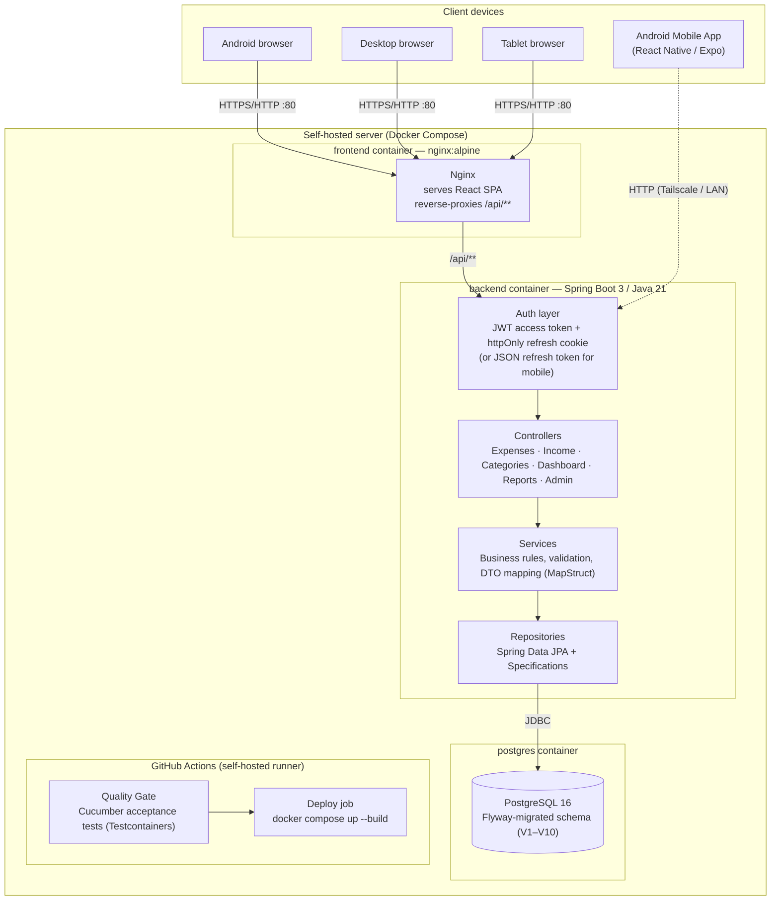

# Expense Tracker

A self-hosted personal expense & income tracking web application. Track daily expenses and income, organise them into custom categories, browse a live dashboard, generate reports, and export everything to CSV — all running on your own hardware with no cloud dependency.

Built with Spring Boot 3 / Java 21, React + MUI, PostgreSQL, Docker Compose, and a full Cucumber acceptance test suite that acts as a quality gate on every deployment.

---

## Architecture



**Request flow:**
- **Web:** Browser → Nginx (serves static React bundle, reverse-proxies `/api/**`) → JWT filter (validates `Authorization: Bearer` header) → Controller → Service (business rules, MapStruct DTO mapping) → Repository (Spring Data JPA + `Specification`-based dynamic queries) → PostgreSQL.
- **Mobile:** React Native App → Tailscale/LAN HTTP → Auth layer (detects `X-Client-Type: mobile` header, manages token lifecycle in `expo-secure-store`) → Controller → Service → PostgreSQL.

**CI/CD flow:**
Every push to `main` triggers a GitHub Actions workflow on the self-hosted runner: the Cucumber acceptance-test suite runs first against an isolated PostgreSQL Testcontainer. Only if all scenarios pass does the deploy job rebuild Docker images and restart the stack.

---

## Tech stack

| Layer | Technology |
|---|---|
| Backend | Java 21, Spring Boot 3.3.4, Spring Security (JWT stateless), Spring Data JPA, Spring Validation, MapStruct, Lombok, Flyway, springdoc-openapi |
| Database | PostgreSQL 16 |
| Frontend (Web) | React 18, Vite, Material UI, Axios, React Router v6, Recharts |
| Mobile (Android) | React Native 0.74, Expo SDK 51, Expo Router, React Native Paper, Expo SecureStore, Android Gradle (API 34) |
| Infra | Docker, Docker Compose, Nginx, DuckDNS (optional), Let's Encrypt / Certbot (optional) |
| Testing — unit/slice | JUnit 5, Mockito, AssertJ, `@DataJpaTest`, `@WebMvcTest`, `@SpringBootTest` |
| Testing — acceptance | Cucumber 7, REST-Assured, Testcontainers (PostgreSQL) |
| CI/CD | GitHub Actions (self-hosted runner) |

---

## Project structure

```
expense-tracker/
├── backend/                     Spring Boot API
│   ├── src/main/java/com/expensetracker/
│   │   ├── entity/              JPA entities: Category, Expense, Income, IncomeCategory,
│   │   │                        User, UserRole, RefreshToken, PaymentMode, CategoryStatus
│   │   ├── repository/          Spring Data repositories + JPA Specifications
│   │   ├── dto/                 Request/response DTOs
│   │   ├── mapper/              MapStruct entity <-> DTO mappers
│   │   ├── service/             Business logic:
│   │   │                        Category · Expense · Income · IncomeCategory ·
│   │   │                        Dashboard · Report · IncomeReport · CsvExport ·
│   │   │                        Auth · AdminUser
│   │   ├── controller/          REST controllers (see API overview below)
│   │   ├── security/            JwtService, JwtAuthenticationFilter, AuthenticatedUser
│   │   ├── config/              SecurityConfig, JwtProperties, OpenAPI config
│   │   └── exception/           Custom exceptions + GlobalExceptionHandler
│   ├── src/main/resources/
│   │   ├── db/migration/        Flyway migrations V1–V10
│   │   └── application*.yml     Config (default, dev, prod, test)
│   ├── src/test/                Unit + slice + integration tests (H2 in-memory)
│   └── Dockerfile
├── acceptance-tests/            Cucumber acceptance / regression tests
│   └── src/test/
│       ├── java/.../steps/      Step definitions: Auth, Expense, Income, DataIsolation, Report
│       └── resources/features/  Gherkin feature files
├── frontend/                    React + MUI SPA (Web)
│   └── src/
│       ├── services/            Axios client + per-domain API services
│       ├── components/          Layout, expense & income & category widgets, common UI
│       ├── pages/               Dashboard, Expenses, Income, Categories, IncomeCategories,
│       │                        Reports, Settings, Login, UserManagement
│       ├── context/             AuthContext (JWT session), NotificationContext
│       └── theme/               Ledger-aesthetic MUI theme
│   └── Dockerfile
├── mobile/                      React Native + Expo Android Mobile App
│   ├── android/                 Native Android project (Gradle, manifest, Tailscale network security)
│   ├── app/                     Expo Router screens & layouts (tabs, auth, modals)
│   ├── services/                Axios API clients & SecureStore token management
│   ├── context/                 AuthContext & NotificationContext
│   ├── components/              Reusable UI components
│   ├── constants/               Payment modes and constants
│   ├── assets/                  App icons and splash screens
│   └── app.json / eas.json      Expo and EAS build configurations
├── docs/                        Extended documentation & technical guides
│   └── mobile-app.md            Mobile architecture, auth flow, and build guide
├── docker/nginx/                Nginx config: reverse proxy, TLS, rate limiting
├── scripts/
│   ├── backup.sh                Automated DB backup to Google Drive
│   ├── restore.sh               Restore DB from backup
│   ├── deploy.sh                Manual deploy helper
│   └── init-letsencrypt.sh      One-time Let's Encrypt bootstrap
├── docker-compose.yml           postgres + backend + frontend + duckdns + certbot
├── .env.example                 All supported environment variables with defaults
└── BUILD_PROGRESS.md            Module-by-module build log
```

---

## Fresh Installation Guide

### Prerequisites

| Requirement | Notes |
|---|---|
| Docker Engine 24+ | Includes Docker Compose v2 (`docker compose`, not `docker-compose`) |
| Git | Any recent version |
| Port 80 open | On the host firewall; also 443 if using HTTPS |

Quick Docker install on Ubuntu 22.04 / 24.04:

```bash
sudo apt update && sudo apt install -y ca-certificates curl
sudo install -m 0755 -d /etc/apt/keyrings
sudo curl -fsSL https://download.docker.com/linux/ubuntu/gpg -o /etc/apt/keyrings/docker.asc
sudo chmod a+r /etc/apt/keyrings/docker.asc
echo "deb [arch=$(dpkg --print-architecture) signed-by=/etc/apt/keyrings/docker.asc] \
  https://download.docker.com/linux/ubuntu $(. /etc/os-release && echo "$VERSION_CODENAME") stable" \
  | sudo tee /etc/apt/sources.list.d/docker.list > /dev/null
sudo apt update && sudo apt install -y docker-ce docker-ce-cli containerd.io docker-compose-plugin
sudo usermod -aG docker $USER   # log out and back in after this
```

---

### Step 1 — Clone the repository

```bash
git clone https://github.com/<your-username>/expense-tracker.git
cd expense-tracker
```

---

### Step 2 — Create your environment file

```bash
cp .env.example .env
```

Open `.env` and set **at minimum** these values:

```env
DB_PASSWORD=<a strong random password>
JWT_SECRET=<at least 32 random characters — generate with: openssl rand -hex 32>
SECURITY_ENABLED=true
CORS_ALLOWED_ORIGINS=http://<your-server-ip>
```

> **Important:** `JWT_SECRET` must be at least 32 characters. If left at the insecure default the backend will refuse to start when `SECURITY_ENABLED=true`.

Full variable reference:

| Variable | Default | Purpose |
|---|---|---|
| `DB_NAME` | `expense_tracker` | PostgreSQL database name |
| `DB_USERNAME` | `expense_user` | PostgreSQL user |
| `DB_PASSWORD` | *(must set)* | PostgreSQL password |
| `DB_HOST_PORT` | `5432` | Host port Postgres is published on |
| `SPRING_PROFILES_ACTIVE` | `prod` | Spring profile (`dev` or `prod`) |
| `CORS_ALLOWED_ORIGINS` | `http://localhost,http://localhost:80` | Allowed CORS origins |
| `SECURITY_ENABLED` | `false` | Set `true` to require JWT login |
| `JWT_SECRET` | *(insecure default — change!)* | HMAC-SHA256 signing key (>=32 chars) |
| `JWT_ACCESS_EXPIRY_MINUTES` | `15` | Access token lifetime |
| `JWT_REFRESH_EXPIRY_DAYS` | `30` | Refresh token lifetime |
| `JWT_COOKIE_SECURE` | `false` | Set `true` when using HTTPS |
| `BACKEND_JAVA_OPTS` | `-Xms256m -Xmx512m` | JVM heap settings |
| `FRONTEND_HOST_PORT` | `80` | Host port for the Nginx container |
| `BACKUP_DIR` | *(set your path)* | Local backup directory |
| `BACKUP_KEEP_DAYS` | `7` | Days of local backups to retain |
| `GDRIVE_REMOTE` | `gdrive` | rclone remote name for Google Drive |
| `GDRIVE_FOLDER` | `expense-tracker-backups` | Google Drive folder for backups |
| `POSTGRES_CONTAINER` | `expense-tracker-db` | Docker container name for pg_dump |

---

### Step 3 — Start the application

```bash
docker compose up -d --build
```

This will:
1. Pull `postgres:16-alpine` and start the database.
2. Build the Spring Boot backend JAR inside a multi-stage Docker image.
3. Build the React frontend with Vite and package it into an Nginx container.
4. Apply all Flyway migrations automatically (schema + seed categories + sample expenses on fresh DB).

Wait ~30–60 seconds, then visit:

- **App:** `http://<server-ip>/`
- **API docs (Swagger UI):** `http://<server-ip>/swagger-ui/index.html`

---

### Step 4 — Create the first account

When `SECURITY_ENABLED=true`, open the app in your browser. The login page detects that no accounts exist and shows a **Register** button. Fill in a username and password (minimum 10 characters). This creates the first and only self-registration — all subsequent accounts must be created by an admin via **Settings → User Management** inside the app.

> If `SECURITY_ENABLED=false` (default), all endpoints are open without login. Suitable for trusted LAN deployments only.

---

### Step 5 — Verify

```bash
# All containers running?
docker compose ps

# Backend health
docker inspect --format='{{.State.Health.Status}}' expense-tracker-backend
# Expected: healthy

# Tail logs
docker compose logs backend --tail 50
docker compose logs frontend --tail 20
```

---

### Managing the application

```bash
# Stop (data preserved in named volume)
docker compose down

# Stop and DELETE the database volume (destructive)
docker compose down -v

# Live logs
docker compose logs -f

# Rebuild after a code change
docker compose up -d --build --remove-orphans

# Open a psql shell
docker exec -it expense-tracker-db psql -U expense_user -d expense_tracker
```

---

## Local Development (hot reload)

### Backend

```bash
# Start a local Postgres instance
docker run -d --name expense-db -p 5432:5432 \
  -e POSTGRES_DB=expense_tracker \
  -e POSTGRES_USER=expense_user \
  -e POSTGRES_PASSWORD=expense_pass \
  postgres:16-alpine

cd backend
mvn spring-boot:run
# Runs on http://localhost:8080 with dev profile (SQL logging on)
```

### Frontend

```bash
cd frontend
npm install

# Point at the local backend
echo "VITE_API_BASE_URL=http://localhost:8080/api" > .env

npm run dev
# Runs on http://localhost:5173 with hot reload
```

### Mobile App (Android / Expo)

```bash
cd mobile
npm install

# Start the Expo development server
npm start

# Run on Android emulator or connected device via ADB
npm run android

# Build standalone debug APK via local Gradle
cd android && ./gradlew assembleDebug
```

> For comprehensive mobile app architecture, Tailscale network configuration, and EAS cloud builds, see the [Mobile App Guide](docs/mobile-app.md).

---

## Running Tests

### Unit and slice tests (fast, no Docker needed)

```bash
cd backend
mvn test
```

Covers repository queries, controller validation/routing, and full-context integration tests using JUnit 5, Mockito, AssertJ, and an in-memory H2 database.

### Cucumber acceptance tests (quality gate, requires Docker)

```bash
# Install backend artifact to local Maven repo (once, or after backend changes)
cd backend
mvn clean install -DskipTests

# Run the full acceptance suite
cd ../acceptance-tests
mvn test
```

Testcontainers spins up a fresh PostgreSQL container automatically. Scenarios covered:

| Feature file | What is tested |
|---|---|
| `auth.feature` | Registration, login, invalid credentials, unauthenticated access |
| `expenses.feature` | Create expense, future-date validation rule, paginated listing |
| `income.feature` | Create income, future-date validation rule, paginated listing |
| `data_isolation.feature` | Per-user data isolation (expenses, income, dashboard) |
| `reports.feature` | Monthly expense/income reports, CSV export |

---

## CI/CD Pipeline

Every push to `main` runs:

```
push to main
    |
    v
[acceptance-tests job]
  - Checkout + set up JDK 21
  - Auto-install Maven if not in PATH
  - mvn clean install -DskipTests   (backend)
  - mvn clean test                   (acceptance-tests; Testcontainers PostgreSQL)
    |
    | (only if all Cucumber scenarios pass)
    v
[deploy job]
  - git pull origin main
  - docker compose up -d --build --remove-orphans
  - Health check backend (docker inspect)
  - Health check frontend (HTTP status on port 80)
```

To set up the self-hosted runner:
1. GitHub repo → **Settings → Actions → Runners → New self-hosted runner**
2. Follow the instructions to install the runner on your server
3. Ensure Docker is installed and the runner user is in the `docker` group

---

## Public HTTPS (optional)

1. Create a free hostname at [duckdns.org](https://www.duckdns.org) and copy your token.
2. In `.env`, set `DOMAIN`, `DUCKDNS_SUBDOMAIN`, `DUCKDNS_TOKEN`, `CERTBOT_EMAIL`, `JWT_COOKIE_SECURE=true`.
3. Forward ports **80 and 443** (TCP) on your router to this server's LAN IP.
4. Start the DNS updater:
   ```bash
   docker compose up -d duckdns
   ```
5. One-time certificate bootstrap:
   ```bash
   ./scripts/init-letsencrypt.sh
   ```
6. Start everything:
   ```bash
   docker compose up -d --build
   ```

Certificate renewal is automatic (checked twice daily). DuckDNS updates your IP every ~5 minutes.

---

## Automated Backups (optional)

```bash
# Install rclone and configure Google Drive once
curl https://rclone.org/install.sh | sudo bash
rclone config   # choose "Google Drive", follow prompts

# Configure in .env:
# BACKUP_DIR, BACKUP_KEEP_DAYS, GDRIVE_REMOTE, GDRIVE_FOLDER, POSTGRES_CONTAINER

# Run manually
./scripts/backup.sh

# Schedule with cron (daily at 2 AM)
(crontab -l; echo "0 2 * * * /path/to/expense-tracker/scripts/backup.sh >> /var/log/expense-backup.log 2>&1") | crontab -
```

Restore from backup:
```bash
./scripts/restore.sh /path/to/backup-file.sql.gz
```

---

## API Overview

Full interactive docs at `/swagger-ui/index.html`.

| Area | Endpoints |
|---|---|
| **Auth** | `POST /api/auth/register`, `/login`, `/refresh`, `/logout`, `/logout-all`, `/change-password`; `GET /api/auth/me`, `/registration-status` |
| **Expenses** | `POST/GET/PUT/DELETE /api/expenses`, `GET /api/expenses/{id}`, `GET /api/expenses/search?keyword=` |
| **Income** | `POST/GET/PUT/DELETE /api/incomes`, `GET /api/incomes/{id}`, `GET /api/incomes/search?keyword=` |
| **Expense Categories** | `POST/GET/PUT/DELETE /api/categories` |
| **Income Categories** | `POST/GET/PUT/DELETE /api/income-categories` |
| **Dashboard** | `GET /api/dashboard` |
| **Expense Reports** | `GET /api/reports/daily`, `/monthly`, `/yearly`, `/range` |
| **Income Reports** | `GET /api/reports/income/daily`, `/monthly`, `/yearly`, `/range` |
| **CSV Export** | `GET /api/reports/export` — params: `date`, `startDate`+`endDate`, `month`+`year`, `year`, `categoryId`, `paymentMode`, `merchant`, `all=true` |
| **Admin** | `GET/POST /api/admin/users`, `PUT /api/admin/users/{id}`, `POST /api/admin/users/{id}/reset-password`, `DELETE /api/admin/users/{id}` |

All error responses share this shape:
```json
{
  "timestamp": "2026-08-11T10:00:00",
  "status": 404,
  "error": "Not Found",
  "message": "Expense not found with id: 42",
  "path": "/api/expenses/42"
}
```

---

## Security Model

When `SECURITY_ENABLED=true`:

- **First-account-only self-registration** — closes automatically after the first user registers. Subsequent accounts are created via admin API or Settings → User Management.
- **Short-lived access tokens** (default 15 min) — carried in the `Authorization: Bearer` header.
- **Long-lived refresh tokens** (default 30 days) — for web clients, stored as an `httpOnly`, `SameSite=Lax` cookie scoped to `/api/auth` (never readable by JavaScript); for mobile clients (identified by `X-Client-Type: mobile`), returned in the JSON body and securely persisted in the hardware-backed keystore via `expo-secure-store`.
- **Refresh token rotation** — each refresh invalidates the old token. Reuse of an already-rotated token revokes all sessions immediately (theft detection).
- **Per-user data isolation** — all queries are scoped to the authenticated `userId`. A user can never read or modify another user's records.
- **Admin role** — first registered user gets `ROLE_ADMIN`. Only admins access `/api/admin/**`.

---

## Database Migrations (Flyway)

Applied automatically on startup:

| Version | Description |
|---|---|
| V1 | Create category table |
| V2 | Create expense table |
| V3 | Seed default expense categories |
| V4 | Seed sample expenses |
| V5 | Create users table |
| V6 | Create refresh_tokens table |
| V7 | Add `user_id` FK to expense (per-user isolation) |
| V8 | Create income_category table |
| V9 | Seed default income categories |
| V10 | Create income table |

> **Production upgrade note:** If you deployed before V7, run `flyway repair` once after upgrading to clear any checksum mismatch, then let the app start normally.

---

## Roadmap

Features implemented beyond the original SRS v1 scope:
- JWT authentication with refresh-token rotation and theft detection
- Native Android Mobile App (React Native / Expo SDK 51 with Tailscale integration & offline debug build)
- Per-user data isolation (multi-account support)
- Income tracking (income entries, income categories, income reports)
- Admin user management (create, update, reset password, delete)
- Automated database backup to Google Drive
- CI/CD pipeline with Cucumber acceptance-test quality gate
- Public HTTPS via DuckDNS + Let's Encrypt

Deferred: budget planning, receipt upload/OCR, AI categorisation, scheduled email reports, offline PWA mode, deeper analytics.

See `BUILD_PROGRESS.md` for the full module-by-module build log.
