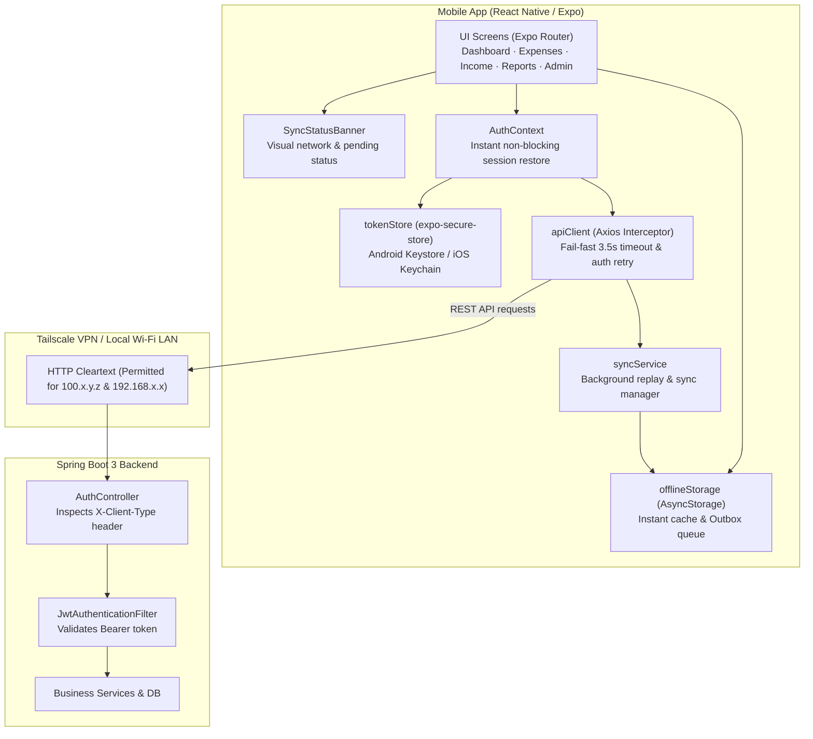
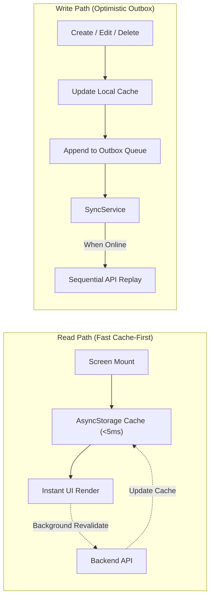

# Mobile App Documentation — Expense Tracker

A cross-platform mobile application for Expense Tracker built with **React Native (0.74)** and **Expo SDK 51**, featuring a native Android project configured for self-hosted deployments over **Tailscale**.

---

## Architecture & Communication



---

## Mobile Authentication Flow

Web clients use `httpOnly`, `SameSite=Lax` cookies for refresh tokens to defend against XSS. However, native mobile apps do not manage `httpOnly` cookies reliably and cannot execute arbitrary browser-injected script.

Instead, the mobile app uses the following secure mobile token pattern:

1. **Header Identification**:
   All mobile API calls send the header:
   ```http
   X-Client-Type: mobile
   ```

2. **Login / Register**:
   - The backend detects the `X-Client-Type: mobile` header in [AuthController.java](file:///c:/Projects/Expense-tracking/Expense-tracker/backend/src/main/java/com/expensetracker/controller/AuthController.java).
   - In addition to setting the cookie (ignored by mobile), the response body contains:
     ```json
     {
       "accessToken": "ey...",
       "tokenType": "Bearer",
       "expiresInSeconds": 900,
       "userId": 1,
       "username": "admin",
       "role": "ROLE_ADMIN",
       "refreshToken": "raw-refresh-token-uuid"
     }
     ```
   - The mobile app saves `refreshToken` into the device's hardware-backed secure store using `expo-secure-store` (Android Keystore). The `accessToken` is kept solely in memory.

3. **Silent Bootstrap & Refresh**:
   - On app startup, [AuthContext.tsx](file:///c:/Projects/Expense-tracking/Expense-tracker/mobile/context/AuthContext.tsx) retrieves the stored refresh token and sends:
     ```http
     POST /api/auth/refresh
     Content-Type: application/json
     X-Client-Type: mobile

     {
       "refreshToken": "raw-refresh-token-uuid"
     }
     ```
   - The backend validates the token, rotates it in the database, and returns a fresh access token and new refresh token.

4. **401 Interceptor & Auto-Retry**:
   - If an API request returns `401 Unauthorized`, [apiClient.ts](file:///c:/Projects/Expense-tracking/Expense-tracker/mobile/services/apiClient.ts) intercepts the failure, invokes `/api/auth/refresh`, updates the stored token, and retries the original request.
   - If the refresh token has expired or been revoked, the user is redirected to the login screen.

---

## Offline-First Architecture & Sync Engine

To allow seamless mobile usage when away from Tailscale or home Wi-Fi, the app implements an offline-first cache and outbox sync engine:



### 1. Persistent Local Storage (`offlineStorage.ts`)
- Utilizes `@react-native-async-storage/async-storage` for durable key-value caching.
- Caches full response payloads for:
  - Dashboard overview metrics & trend data
  - Expense & income paginated lists and search results
  - Expense and income category catalogs
- Screen hooks read from cache synchronously on mount, yielding instantaneous screen loads (<5ms) without waiting for network timeouts.

### 2. Optimistic Mutations & Outbox Queue (`syncService.ts`)
- When creating, updating, or deleting an expense, income entry, or category:
  - If network is unreachable or request times out, a local synthetic record (e.g. temporary negative ID `Date.now()`) is added directly to cache so the UI updates immediately.
  - A queued mutation action (`CREATE_EXPENSE`, `UPDATE_EXPENSE`, `DELETE_EXPENSE`, etc.) is appended to the persistent FIFO outbox in `AsyncStorage`.
- `syncPendingMutations()` is triggered whenever:
  - The app returns to the foreground.
  - A successful network request confirms connectivity.
  - The user manually triggers sync from the `SyncStatusBanner`.

### 3. Startup & Timeout Optimizations
- **Non-blocking Auth Bootstrap**: `AuthService.bootstrapSession()` restores user session from storage instantaneously (<2ms). It dispatches a background refresh token exchange without delaying the UI render.
- **Fail-Fast Network Timeout**: Axios `timeout` in `apiClient.ts` is configured to **3,500ms** (down from standard 15,000ms). When disconnected from VPN/LAN, API attempts fail rapidly, falling back to cached state without stalling the interface.
- **Visual Status**: `SyncStatusBanner.tsx` displays non-intrusive status indicators:
  - *Offline (using cached data)*
  - *Syncing...*
  - *X changes pending sync*

---

## Native Android Configuration

The mobile app includes a prebuilt Android project located in `mobile/android/`.

### Cleartext Traffic & Network Security
Self-hosted instances on home networks or Tailscale typically run over plain HTTP:
- In [network_security_config.xml](file:///c:/Projects/Expense-tracking/Expense-tracker/mobile/android/app/src/main/res/xml/network_security_config.xml), cleartext traffic is permitted via `<base-config cleartextTrafficPermitted="true">`.
- **Why this configuration is required**: Android OS rejects unencrypted HTTP by default. While `<domain>` tags allow whitelisting individual hostnames, Android's network security parser **does not support subnet/CIDR notation** (such as `192.168.0.0/16`). Whitelisting `192.168.0.0` will *not* match `192.168.29.70`. Permitting cleartext via `base-config` allows any local LAN or Tailscale IP to connect over HTTP.
- **Important**: Because `network_security_config.xml` is compiled directly into the native Android application bundle, **any edits to this file require recompiling the APK** (`./gradlew assembleDebug` or EAS build) to take effect on physical devices.
- `mobile/android/app/src/main/AndroidManifest.xml` wires `android:networkSecurityConfig="@xml/network_security_config"` and `android:usesCleartextTraffic="true"`.

### Keystores
- `mobile/android/app/debug.keystore`: standard Expo debug keystore committed for instant local debug builds.
- Release signing keys (`*.jks`, `*.keystore`) are excluded in `.gitignore`.

---

## Project Structure

```
mobile/
├── .expo/                       (Ignored) Local build cache & preview files
├── android/                     Native Android project (Gradle, manifest, configs)
│   ├── app/
│   │   ├── build.gradle
│   │   ├── debug.keystore
│   │   └── src/main/
│   │       ├── AndroidManifest.xml
│   │       ├── java/com/expensetracker/mobile/
│   │       └── res/xml/network_security_config.xml
│   ├── build.gradle
│   ├── gradlew / gradlew.bat
│   └── settings.gradle
├── app/                         Expo Router file-based routing
│   ├── _layout.tsx              Root layout with PaperProvider & AuthProvider
│   ├── (auth)/                  Unauthenticated route group
│   │   ├── _layout.tsx
│   │   └── login.tsx            Login / Registration screen
│   └── (app)/                   Authenticated tab & modal route group
│       ├── _layout.tsx          Bottom tabs navigator
│       ├── index.tsx            Dashboard (instant cache & sync banner)
│       ├── expenses.tsx         Expense list with offline outbox & sync banner
│       ├── income.tsx           Income list with offline outbox & sync banner
│       ├── reports.tsx          Monthly/yearly reports with CSV native share export
│       ├── categories.tsx       Expense category management
│       ├── income-categories.tsx Income category management
│       ├── settings.tsx         Server URL config (smart normalization), logout
│       └── admin/users.tsx      Admin user management
├── assets/                      App icons, adaptive icons, and splash screens
├── components/                  Reusable UI components
│   ├── SyncStatusBanner.tsx     Offline indicator & pending sync manager banner
│   └── DropdownSelect.tsx
├── constants/                   Payment modes and styling constants
├── context/                     AuthContext and NotificationContext
├── services/                    Axios services matching backend REST endpoints
│   ├── apiClient.ts             Axios instance with mobile auth headers & 3.5s timeout
│   ├── tokenStore.ts            SecureStore token wrapper
│   ├── authService.ts           Fast bootstrap & auth lifecycle
│   ├── expenseService.ts        Cached & outbox-enabled expense service
│   ├── incomeService.ts         Cached & outbox-enabled income service
│   ├── categoryService.ts       Cached category service
│   ├── incomeCategoryService.ts
│   ├── dashboardService.ts      Cached dashboard service
│   ├── reportService.ts
│   ├── adminService.ts
│   └── offline/
│       ├── offlineStorage.ts    AsyncStorage persistent cache engine
│       └── syncService.ts       FIFO outbox queue & auto-sync replay engine
├── app.json                     Expo project manifest
├── eas.json                     EAS build profiles (preview, production)
├── babel.config.js              Babel configuration with Expo Router plugin
├── package.json                 Dependencies and npm scripts
└── tsconfig.json                TypeScript compiler configuration
```

---

## Development & Build Instructions

### Prerequisites
- Node.js 18+
- npm or yarn
- Android Studio + Android SDK (API 34+) for local emulator/device testing
- Expo CLI & EAS CLI: `npm install -g eas-cli`

### Local Development
```bash
cd mobile

# Install dependencies
npm install

# Start the Expo development server
npm start

# Run on an Android emulator or connected device
npm run android
```

### Server URL Configuration
1. The app defaults to connecting to `http://100.103.68.49/api` (Tailscale VPN).
2. To point to your home Wi-Fi LAN or any other server:
   - In the mobile app, navigate to **Settings tab → Server Connection**.
   - Enter your server IP or address (e.g., `192.168.29.70`, `http://192.168.29.70`, or `http://192.168.29.70/api`).
   - The app automatically prepends `http://` if omitted and ensures `/api` is cleanly appended.
   - Click **Save Connection URL**. The configuration is saved in local device storage and takes effect immediately.

### Building APKs

#### Via EAS Cloud Build
```bash
# Build standalone preview APK (direct download, no Google Play required)
npm run build:android:preview

# Build production AAB for Google Play
npm run build:android:production
```

#### Via Local Gradle (Offline)
```bash
cd mobile/android
./gradlew assembleDebug
# The APK is generated at: mobile/android/app/build/outputs/apk/debug/app-debug.apk
```
