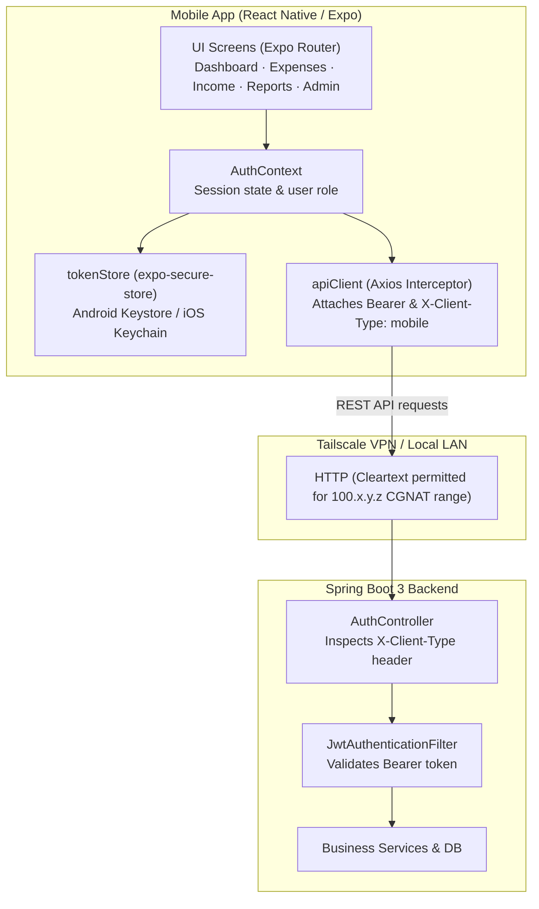

# Mobile App Documentation — Expense Tracker

A cross-platform mobile application for Expense Tracker built with **React Native (0.74)** and **Expo SDK 51**, featuring a native Android project configured for self-hosted deployments over **Tailscale**.

---

## Architecture & Communication



---

## Mobile Authentication Flow

Web clients use `httpOnly`, `SameSite=Lax` cookies for refresh tokens to defend against XSS. However, native mobile apps do not manage `httpOnly` cookies reliably and cannot execute arbitrary browser-injected script.

Instead, the mobile app uses the following secure mobile token pattern:

1. **Header Identification**:
   All mobile API calls send the header:
   ```http
   X-Client-Type: mobile
   ```

2. **Login / Register**:
   - The backend detects the `X-Client-Type: mobile` header in [AuthController.java](file:///c:/Projects/Expense-tracking/Expense-tracker/backend/src/main/java/com/expensetracker/controller/AuthController.java).
   - In addition to setting the cookie (ignored by mobile), the response body contains:
     ```json
     {
       "accessToken": "ey...",
       "tokenType": "Bearer",
       "expiresInSeconds": 900,
       "userId": 1,
       "username": "admin",
       "role": "ROLE_ADMIN",
       "refreshToken": "raw-refresh-token-uuid"
     }
     ```
   - The mobile app saves `refreshToken` into the device's hardware-backed secure store using `expo-secure-store` (Android Keystore). The `accessToken` is kept solely in memory.

3. **Silent Bootstrap & Refresh**:
   - On app startup, [AuthContext.tsx](file:///c:/Projects/Expense-tracking/Expense-tracker/mobile/context/AuthContext.tsx) retrieves the stored refresh token and sends:
     ```http
     POST /api/auth/refresh
     Content-Type: application/json
     X-Client-Type: mobile

     {
       "refreshToken": "raw-refresh-token-uuid"
     }
     ```
   - The backend validates the token, rotates it in the database, and returns a fresh access token and new refresh token.

4. **401 Interceptor & Auto-Retry**:
   - If an API request returns `401 Unauthorized`, [apiClient.ts](file:///c:/Projects/Expense-tracking/Expense-tracker/mobile/services/apiClient.ts) intercepts the failure, invokes `/api/auth/refresh`, updates the stored token, and retries the original request.
   - If the refresh token has expired or been revoked, the user is redirected to the login screen.

---

## Native Android Configuration

The mobile app includes a prebuilt Android project located in `mobile/android/`.

### Cleartext Traffic & Network Security
Because self-hosted instances on home networks or Tailscale often run over plain HTTP:
- `mobile/android/app/src/main/res/xml/network_security_config.xml` configures Android to allow cleartext traffic specifically for:
  - Configured Tailscale IP (`100.103.68.49`)
  - Tailscale CGNAT IP range (`100.64.0.0/10`)
  - Local home network range (`192.168.0.0/16`)
- `mobile/android/app/src/main/AndroidManifest.xml` wires `android:networkSecurityConfig="@xml/network_security_config"` and `android:usesCleartextTraffic="true"`.

### Keystores
- `mobile/android/app/debug.keystore`: standard Expo debug keystore committed for instant local debug builds.
- Release signing keys (`*.jks`, `*.keystore`) are excluded in `.gitignore`.

---

## Project Structure

```
mobile/
├── .expo/                       (Ignored) Local build cache & preview files
├── android/                     Native Android project (Gradle, manifest, configs)
│   ├── app/
│   │   ├── build.gradle
│   │   ├── debug.keystore
│   │   └── src/main/
│   │       ├── AndroidManifest.xml
│   │       ├── java/com/expensetracker/mobile/
│   │       └── res/xml/network_security_config.xml
│   ├── build.gradle
│   ├── gradlew / gradlew.bat
│   └── settings.gradle
├── app/                         Expo Router file-based routing
│   ├── _layout.tsx              Root layout with PaperProvider & AuthProvider
│   ├── (auth)/                  Unauthenticated route group
│   │   ├── _layout.tsx
│   │   └── login.tsx            Login / Registration screen
│   └── (app)/                   Authenticated tab & modal route group
│       ├── _layout.tsx          Bottom tabs navigator
│       ├── index.tsx            Dashboard (summary metrics, charts, quick actions)
│       ├── expenses.tsx         Expense list with search, filter, pagination, add/edit
│       ├── income.tsx           Income list with search, filter, pagination, add/edit
│       ├── reports.tsx          Monthly/yearly reports with CSV native share export
│       ├── categories.tsx       Expense category management
│       ├── income-categories.tsx Income category management
│       ├── settings.tsx         Server URL config, change password, logout
│       └── admin/users.tsx      Admin user management
├── assets/                      App icons, adaptive icons, and splash screens
├── components/                  Reusable UI components (e.g. DropdownSelect)
├── constants/                   Payment modes and styling constants
├── context/                     AuthContext and NotificationContext
├── services/                    Axios services matching backend REST endpoints
│   ├── apiClient.ts             Axios instance with mobile auth headers & interceptors
│   ├── tokenStore.ts            SecureStore token wrapper
│   ├── authService.ts
│   ├── expenseService.ts
│   ├── incomeService.ts
│   ├── categoryService.ts
│   ├── incomeCategoryService.ts
│   ├── dashboardService.ts
│   ├── reportService.ts
│   └── adminService.ts
├── app.json                     Expo project manifest
├── eas.json                     EAS build profiles (preview, production)
├── babel.config.js              Babel configuration with Expo Router plugin
├── package.json                 Dependencies and npm scripts
└── tsconfig.json                TypeScript compiler configuration
```

---

## Development & Build Instructions

### Prerequisites
- Node.js 18+
- npm or yarn
- Android Studio + Android SDK (API 34+) for local emulator/device testing
- Expo CLI & EAS CLI: `npm install -g eas-cli`

### Local Development
```bash
cd mobile

# Install dependencies
npm install

# Start the Expo development server
npm start

# Run on an Android emulator or connected device
npm run android
```

### Server URL Configuration
1. The app defaults to connecting to `http://100.103.68.49/api`.
2. To point to your own host or local server:
   - In the mobile app, navigate to **Settings tab → Server Connection**.
   - Update the Server URL (e.g., `http://192.168.1.100:8080/api` or `https://expense.yourdomain.com/api`).
   - Click **Save**. The URL is saved locally in `AsyncStorage` and applied to all future API calls.

### Building APKs

#### Via EAS Cloud Build
```bash
# Build standalone preview APK (direct download, no Google Play required)
npm run build:android:preview

# Build production AAB for Google Play
npm run build:android:production
```

#### Via Local Gradle (Offline)
```bash
cd mobile/android
./gradlew assembleDebug
# The APK is generated at: mobile/android/app/build/outputs/apk/debug/app-debug.apk
```
